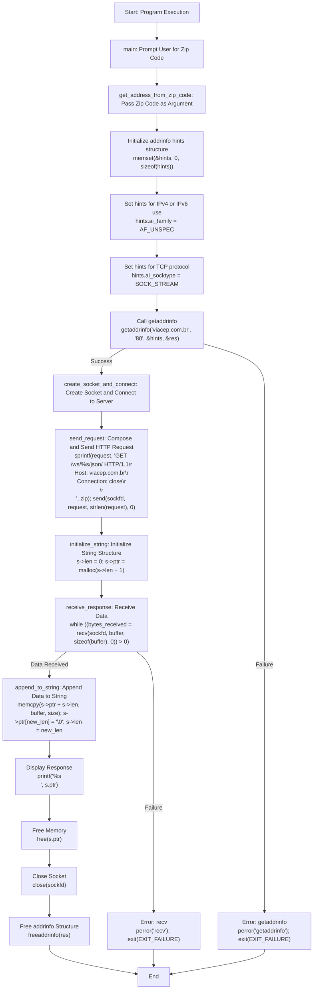
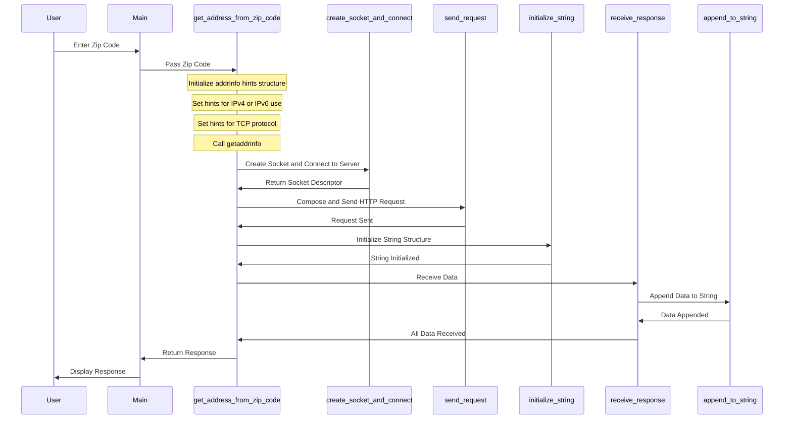

# Address Finder

This project allows you to enter a Brazilian zip code and retrieves the corresponding address information by interacting with the `viacep.com.br` API. It is written in C and demonstrates basic socket programming and HTTP request handling.

## Compilation

To compile the program, use the following command:

```bash
gcc -o AddressFinder main.c
```

## Usage
Run the compiled binary, then enter a Brazilian zip code when prompted:
```bash
./AddressFinder
```

## Code Overview
Here is a detailed flowchart of the program's logic, illustrated using Mermaid syntax:


### Sequence Diagram


